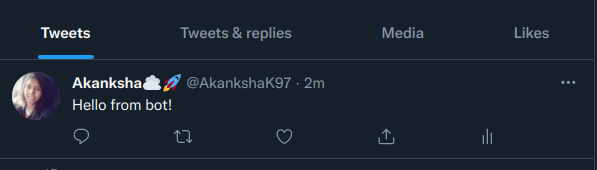

[](https://goreportcard.com/report/github.com/akankshakumari393/twitter-bot)

# twitter-bot
A Twiiter bot that post a status on the user timeline. It uses V1.1 twitter APIs. 

## Add an `.env` file with below keys (These keys would be generated from twitter developer account):

```
CONSUMER_KEY=""
CONSUMER_SECRET=""
ACCESS_TOKEN=""
ACCESS_TOKEN_SECRET=""
```

## To run the program use build script `./build/build.sh {path_to_.env_file}`

```
./build/build.sh ./.env
```




## With this, we Learned
* OAuth1
* Explored Twitter APIs
